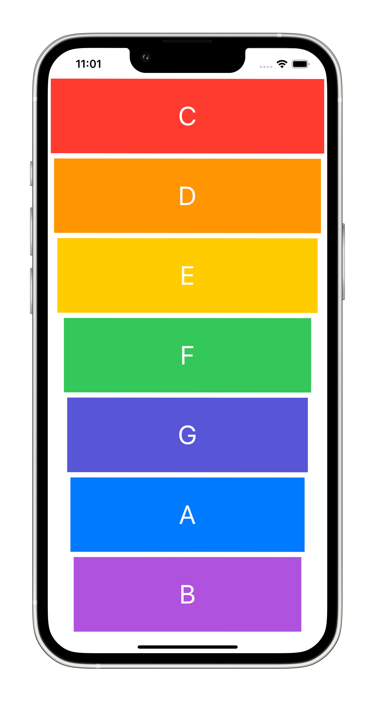

# Xylophone

## What has been studied

* How to play sound using AVFoundation and AVAudioPlayer.
* Functions and methods in Swift. 
* Data types.
* Swift loops.
* Variable scope.
* The ViewController lifecycle.
* Error handling in Swift.
* Code refactoring.
* Basic debugging.

<table>
  <tr>
    <td></td>
    </tr>
 </table>